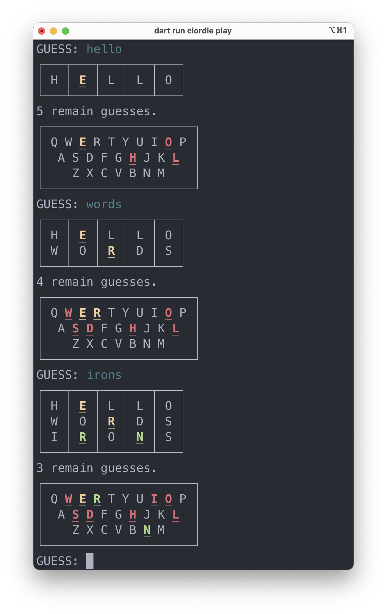

# Clordle

A Wordle clone built for the command line with Dart.

[](https://pub.dev/packages/very_good_analysis)

## Install

```sh
dart pub global activate clordle
```

## Playing

Show game options:

```sh
clordle play --help
```

Options:

```
Start the Clordle game.

Usage: clordle play [arguments]
-h, --help    Print this usage information.
-w, --word    The target word. Used for debugging.
-m, --max     The max number of guesses/tries.
              (defaults to "6")

Run "clordle help" to see global options.
```

Start playing:

```sh
clordle play
```


